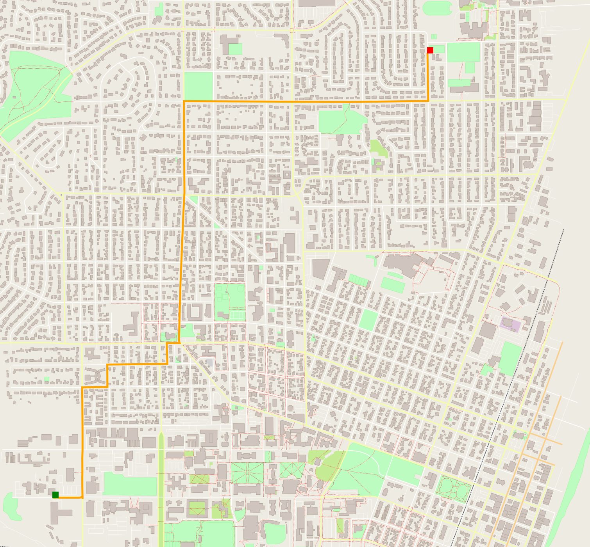

# Route Planning in Open Street Map 

This repo contains the code for the Route Planning project that takes an open street map and finds shortest path between any two points using Astar algorithm.
This can be further expanded to act as a mission planner for planning routes for a self-driving car on any given map.
## Dependencies for Running Locally
* cmake >= 3.11.3
    * All OSes: [click here for installation instructions](https://cmake.org/install/)
* make >= 4.1 (Linux, Mac), 3.81 (Windows)
    * Linux: make is installed by default on most Linux distros
    * Mac: [install Xcode command line tools to get make](https://developer.apple.com/xcode/features/)
    * Windows: [Click here for installation instructions](http://gnuwin32.sourceforge.net/packages/make.htm)
* gcc/g++ >= 7.4.0
    * Linux: gcc / g++ is installed by default on most Linux distros
    * Mac: same instructions as make - [install Xcode command line tools](https://developer.apple.com/xcode/features/)
    * Windows: recommend using [MinGW](http://www.mingw.org/)
* IO2D
    * Installation instructions for all operating systems can be found [here](https://github.com/cpp-io2d/P0267_RefImpl/blob/master/BUILDING.md)
    * Make sure to run sudo make install after cmake in order to install it in proper location.(For Ubuntu/Linux)

## Get started
```shell
git clone https://github.com/nirajbasnet/OSM_Route_Planner --recurse-submodules
cd OSM_Route_Planner/
mkdir build && cd build/
cmake ..
make
```

### Running
The executable will be placed in the `build` directory. From within `build`, you can run the project as follows: This uses the default map file "map.osm".
```
./OSM_A_star_search
```
Or to specify a map file:
```
./OSM_A_star_search -f ../<your_osm_file.osm>
```
## Using Route Planner

Once the program is compiled and run, it asks the user for 4 coordinates ranging from 0 to 99: `start x`, `start y`, `end x` and `end y`. 
Then it calculates the shortest distance using Astart search between these two points and renders the road from the `start` point to the `end` on the map. 
The program by default uses `map.osm` which is placed in the project directory. However, any other maps can be used by passing it as argument. 
An example of passing a city map(Corvallis,Oregon) is shown below. You can also download your desired map from [Openstreet map site.](https://www.openstreetmap.org/)


## Searching on custom map - Corvallis,Oregon 

```
Usage: [executable] [-f filename.osm]
./OSM_A_star_search -f ../corvallis_map.osm
Reading OpenStreetMap data from the following file: corvallis_map.osm
Enter start x btw. 0 - 99: 10
Enter start y btw. 0 - 99: 10
Enter end x btw. 0 - 99: 75
Enter end y btw. 0 - 99: 90

```
Program output:
```
Distance: 2985.21 meters.
```



## Testing

The testing executable is also placed in the `build` directory. From within `build`, you can run the unit tests as follows:
```
./test
```

